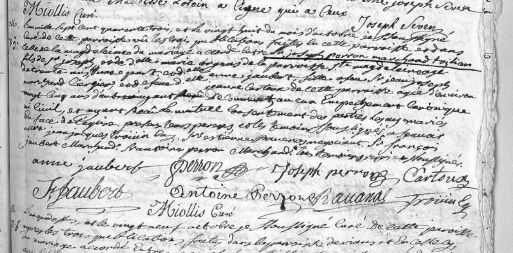

# Los antepasados franceses de Perón, en documentos inéditos que salen a la luz

Ignacio Cloppet.
Clarin.
18-Oct-2019

Revelaciones. Siempre se dijo que el origen del apellido Perón era italiano. Nuevas investigaciones certifican que sus ancestros provenían de la región de Provenza.

La historia es dinámica, está en constante movimiento. 
Los relatos no resisten un archivo, que cada vez que se consultan, transforman realidades.

Desde siempre se dijo que el origen del apellido Perón era italiano, aunque también se contempló que podría ser español o francés. 

El mismo Juan D. Perón reconoció en reportajes, que: 

> “Mi familia es de origen sardo, pero mis antepasados llegaron aquí hace varias generaciones (…)
> Mi apellido es italiano, y encontré en Italia varios Perón (…)
> Acaso soy descendiente de españoles afincados en Cerdeña desde la época en que España ocupaba la isla (…)
> En tiempos de Napoleón, muchos sardos peleaban por la independencia de la isla (…)
> Uno de estos sardos disidentes fue mi bisabuelo, el hijo del médico, quien emigró a Buenos Aires”.

A decir verdad, Perón desconocía absolutamente la historia sobre sus orígenes. 
Más bien, fue un argentino que no le interesó mirar hacia atrás, hacia su pasado familiar, seguramente influenciado por su abuela Dominga Dutey, para evitar caer en el trago amargo de la nostalgia que provoca el destierro.

Es cierto que su bisabuelo Perron nació en Génova. 
Ahora bien, no se sabe a ciencia cierta, de que pueblo provenían sus ancestros. 
Sobre esta cuestión, los biógrafos especularon diciendo que eran italianos de Génova o de Cerdeña, que fueron prestigiosos médicos, sin siquiera precisar ningún documento que lo defina.

Hace años que estoy estudiando los orígenes de Perón. 
He publicado dos libros, donde –entre tantos hallazgos– comprobé sus raíces vascas (los Dutey–Bergouignan) en Banca y Baigorry, Iparralde; su criollaje (los Sosa–Toledo) que se remontan con 16 generaciones a conquistadores como Mencia Calderón Ovando. 
Pude también derribar el mito de que su bisabuela doña María Victoria Gaona era tehuelche, al acreditar que no era india sino blanca e hija legítima de españoles, tal cual surge de su partida de bautismo del 8/7/1821. 
Hasta llegué a demostrar el parentesco que existe entre Perón y Borges. 
Pero, lo que no había podido revelar, hasta hoy, fueron los ancestros paternos de Perón.

El fundador del linaje de Juan D. Perón, se remonta a comienzos del siglo XVII en Aix–en–Provence (Provenza, sur de Francia), con François Perron y Marie Pourcel, los trischoznos de Juan D. Perón. 
Fueros padres de Joseph Perron (1674–1749), un comerciante y burgués que se casó con Marie Madeleine Orgeas (1692–1747).

Gracias al investigador de Mamoiada (Cerdeña) Raffaele Ballore, un infatigable estudioso de los ancestros paternos de Perón, coautor con Piero Salerno de la nueva edición del libro “Il caso Piras-Perón, chi bleffa e chi nón” (de próxima aparición), he podido acceder a unos documentos inéditos escritos en latín, del Archivio Storico chiesa Della Maddalena y del Archivio Storico Comune di Genova, que prueban el verdadero origen.

El bisabuelo de Juan D. Perón, que emigró de Génova a bordo del buque “San Ambrosio”, y llegó al puerto de Buenos Aires el 16/9/1831, se llamaba Fortunato Tomás Mario Perron (a veces escrito como Peron – Perrone). 
Nació y fue bautizado en la ciudad de Génova, parroquia N.S. della Maddalena el 17/2/1799, conforme acta de Bautismo (Fº 179).

He contado con la colaboración del genealogista Roger Delagliere, para determinar que su padre, el francés Marius Toussaint Perron, nació en Aix–en–Provence y fue bautizado en la Parroquia S. Madeleine el sábado 1/1/1767, hijo de Joseph Perron (un burgués comerciante de telas y algodón) y de Anne Joubert (nacidos en 1727 y casados en Aix–en–Provence, Parroquia de S. Sauveur el 28/10/1743), padres de 7 hijos. 
Marius Perron junto a su padre y hermanos tuvieron que emigrar a Génova por la Revolución de 1789, habiendo sufrido la confiscación de sus bienes y huyendo de la guillotina o la prisión.

Su madre, fue la genovesa María Rosa Caterina Poggi, hija de Tomaso Poggi y de María Argentina Altavilla, de Rivarolo Ligure (hoy un municipio de Génova). 
La familia Poggi era de clase media alta; su apellido es antiguo y muy arraigado en Génova.

Marius Perron y Rosa Poggi (tatarabuelos de Perón) se casaron el 27/8/1795 en la parroquia N.S. della Maddalena, y tuvieron 3 hijos. 
Rosa Poggi, padeció problemas de salud después de nacer su hijo varón Fortunato Mario Tomas. Murió a los 19 años, el 4/1/1800.

En una de las páginas del Censo de 1808 de Génova (escrito en francés por la ocupación napoleónica), en la vía della Maddalena 101, reside la familia Perron–Poggi, de donde surge que el tatarabuelo de Juan D. Perón, el francés Mario Perron (e) (de 40 años) era un teneur de livres –o sea un contador­ público– (y no médico, como se dijo siempre). 
Aparece casado con su 2ª esposa Maria Serra (23 a.), y sus hijos: Anne (10 a.), Pierrine (9 a.) y Fortunato Mario Tomas (8 a.). 
En el mismo edificio, vive su suegro Thomas Poggi (50 a.); junto a él está su 2ª esposa Maria Doero (20 a.). Tomas Poggi era “commis de merchand de coton” (o sea un vendedor y comerciante de algodón).

Esta es la verdad sobre el origen paterno de Juan D. Perón. 
Sus ancestros Perron no eran italianos, ni sardos, ni médicos. 
La verdad es que fueron franceses, contadores públicos, comerciantes de telas y burgueses, originarios de Aix–en–Provence (la misma ciudad donde nació el famoso pintor Paul Cézanne).

El bisabuelo inmigrante de Perón, Tomás Perron, se casó en la Parroquia S. Miguel de Buenos Aires el 12/9/1833, con la señorita Ana Hughes, natural de Londres, y fueron padres de 8 hijos. 
El primogénito fue el famoso médico Tomás Liberato Perón, el abuelo de Perón que cambió la formulación del apellido.

¿Qué importancia tiene todo esto? Necesariamente, saber de dónde venimos, que tiene sustento en el aforismo socrático “conócete a ti mismo”.

Los hombres son lo que son, no sólo por lo que hacen, sino también por la historia familiar que traen consigo: la genética, la sangre, los lugares, las casas donde nacieron, los pueblos de donde provienen, todas ellas condiciones indispensables para construir y conocer más cabalmente a una persona, en este caso la de Juan D. Perón.

Transcurridos 45 años de su muerte y 124 de su nacimiento, su historia sigue dando sorpresas y merece seguir siendo revisada, donde estos hallazgos nos muestran que el universo Perón es inconmensurable.
